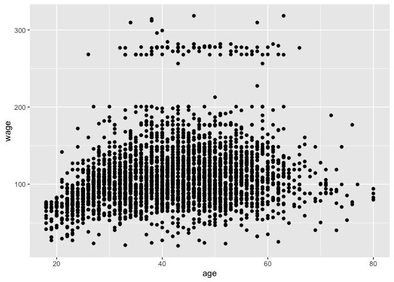
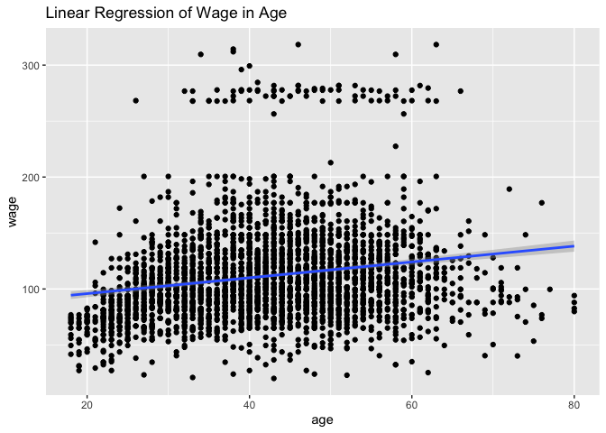
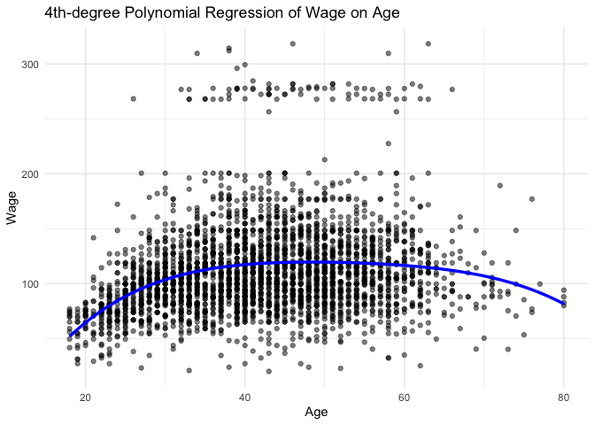

Moving Beyond Linearity
================

## Background

Linear models are relatively simple to describe and implement, and have
advantages over other approaches in terms of interpretation and
inference. However, standard linear regression can have limitations in
terms of predictive power because the assumption of linearity is almost
always an approximation, and sometimes a poor one. Linearity (the
relationship between the predictors and the outcome is linear) is one of
the assumptions of linear regression model. There are several
statistical methods to handle the non linearity. Most sophisticated is
the extension of linear model like polynomial regression, step functions
and splines.

## Polynomial Regression

**Polynomial regression** extends the linear model by adding extra
predictors, obtained by raising each of the original predictors to a
power. For example, a cubic regression uses three variables, $x$, $x^2$,
and $x^3$, as predictors. This approach provides a simple way to provide
a non-linear fit to data.

The relationship between the predictors and the response is non-linear
has been to replace the standard linear model

$$
y_i = β_0 + β_1x_i + ϵ_i
$$

with a polynomial function

$$
y_i = \beta_0 + \beta_1 x_i + \beta_2 x_i^3 + \beta_3x_i^3 + ... + \beta_dx_i^d + \epsilon_i
$$

where ϵi is the error term.

For large enough degree d, a polynomial regression allows us to produce
an extremely non-linear curve. Generally, it is unusual to use d greater
than 3 or 4 because for large values of d, the polynomial curve can
become overly flexible and can take on some very strange shapes.

# Practical Example

We will be analysing complex data ***Wage***. We begin by loading the
ISLR2 library, which contains the data. This data is has 3000
observation of 11 different variables which includes year, age, marital
status, race, logwage, wage, among other.

``` r
library(ISLR2)
library(ggplot2)
wage <- Wage
```

# Assessing non-linearity by visualization

``` r
ggplot(data = wage, aes(x = age, y = wage)) + 
  geom_point()
```

<!-- -->

``` r
# Fitting linear regression

ggplot(data = wage, aes(x = age, y = wage)) + 
  geom_point() + geom_smooth(method = "lm") +
  labs(title = "Linear Regression of Wage in Age")
```

    ## `geom_smooth()` using formula = 'y ~ x'

<!-- -->

# Fitting polynomial regression model

``` r
polyfit <- lm(wage ~ poly(age, 4), data = wage)
coef(summary(polyfit))
```

    ##                 Estimate Std. Error    t value     Pr(>|t|)
    ## (Intercept)    111.70361  0.7287409 153.283015 0.000000e+00
    ## poly(age, 4)1  447.06785 39.9147851  11.200558 1.484604e-28
    ## poly(age, 4)2 -478.31581 39.9147851 -11.983424 2.355831e-32
    ## poly(age, 4)3  125.52169 39.9147851   3.144742 1.678622e-03
    ## poly(age, 4)4  -77.91118 39.9147851  -1.951938 5.103865e-02

This syntax fits a linear model, using the $lm()$ function, in order to
predict wage using a fourth-degree polynomial in age: $poly(age, 4)$.

\###**Visualizing our fitted model**

``` r
# Create a new data frame for prediction
age_grid <- data.frame(age = seq(min(wage$age), max(wage$age), length.out = 100))

# Predict fitted values
age_grid$predicted_wage <- predict(polyfit, newdata = age_grid)

# Plot
ggplot(wage, aes(x = age, y = wage)) +
  geom_point(alpha = 0.5) +                     # original points
  geom_line(data = age_grid, aes(x = age, y = predicted_wage), color = "blue", size = 1.2) +
  labs(title = "4th-degree Polynomial Regression of Wage on Age",
       x = "Age", y = "Wage") +
  theme_minimal()
```

<!-- -->

### **How to decide the degree of polynomial to use?**

In performing a polynomial regression we must decide on the degree of
the polynomial to use. You can do Cross validation, Likelihood Ratio
test, hypothesis test, check AIC. One way to do this is by using
hypothesis tests. We now fit models ranging from linear to a degree-5
polynomial and seek to determine the simplest model which is sufficient
to explain the relationship between wage and age. We use the $anova()$
function, which performs an analysis of variance (ANOVA, using an
F-test) in order to test the null hypothesis that a model M1 is
sufficient to explain the data against the alternative hypothesis that a
more complex model M2 is required.

``` r
poly.M1 <- lm(wage ~ age, data = wage)
poly.M2 <- lm(wage ~ poly(age, 2), data = wage)
poly.M3 <- lm(wage ~ poly(age, 3), data = wage)
poly.M4 <- lm(wage ~ poly(age, 4), data = wage)
poly.M5 <- lm(wage ~ poly(age, 5), data = wage)

anova(poly.M1,poly.M2,poly.M3,poly.M4,poly.M5)
```

    ## Analysis of Variance Table
    ## 
    ## Model 1: wage ~ age
    ## Model 2: wage ~ poly(age, 2)
    ## Model 3: wage ~ poly(age, 3)
    ## Model 4: wage ~ poly(age, 4)
    ## Model 5: wage ~ poly(age, 5)
    ##   Res.Df     RSS Df Sum of Sq        F    Pr(>F)    
    ## 1   2998 5022216                                    
    ## 2   2997 4793430  1    228786 143.5931 < 2.2e-16 ***
    ## 3   2996 4777674  1     15756   9.8888  0.001679 ** 
    ## 4   2995 4771604  1      6070   3.8098  0.051046 .  
    ## 5   2994 4770322  1      1283   0.8050  0.369682    
    ## ---
    ## Signif. codes:  0 '***' 0.001 '**' 0.01 '*' 0.05 '.' 0.1 ' ' 1

The ANOVA comparison indicates that the polynomial terms upto degree 3
significantly improve model fit. Higher order terms beyond 3 do not
provide significant meaningful results, suggesting that the cubic
polynomial is sufficient.

## Step Function

**Step functions** cut the range of a variable into K distinct regions
in order to produce a qualitative variable. This has the effect of
fitting a piece wise constant function. We break the range of X into
bins, and fit a different **constant** in each bin.

## Regression Splines

**Regression splines** are more flexible than polynomials and step
functions, and in fact are an extension of the two. They involve
dividing the range of $X$ into K distinct regions. Within each region, a
polynomial function is fit to the data. However, these polynomials are
constrained so that they join smoothly at the region boundaries, or
knots. Provided that the interval is divided into enough regions, this
can produce an extremely flexible fit.

Divide $X$ into smaller sub-intervals,

$$
x_{min} = t_0 < t_1 < .... t_m < t_{m+1} = x_{max}
$$

The breakpoints $t_1$, $t_m$, $t_{m +1}$ are called knots.

We construct $m + 1$ intervals, and for each sub intervals, we apply
$m + 1$ polynomial functions as mentioned below:

$$ 
f_i(x) = β_{i,0} + β_{i,1}x_1 + β_{i,2}x_2 + β_{i,3}x_3 ....
$$

for $$ i \in [t_0, t_1], [t_1, t_2], ... [t_m, t_{m+1}] $$

where, $x_1, x_2, x_3$ are corresponding polynomial covariates.

## Constraint

**In the next step**, we must ensure that the fitted functions should be
continuous and smooth at each knot. In other words, there should not be
sudden jump or sudden fall in our function at each interior knot. To
solve this, if we have K knots, this is done by making continuous
derivative up to (K-1) order. Assumption of continuous derivatives
ensures that polynomial pieces are joining together smoothly at all
interior knot points.

A polynomial spline of degree p is a function that

- Consists of a polynomial of degree p within each of the intervals, and

- Has continuous derivatives up to the order (p−1) at each knot.

- e.g., a cubic spline consists of polynomial transformations of degree
  3 within each interval and has 2 times continuous derivatives.

## Smoothing Splines

**Smoothing splines** are similar to regression splines, but arise in a
slightly different situation. Smoothing splines result from minimizing a
residual sum of squares criterion subject to a smoothness penalty.
