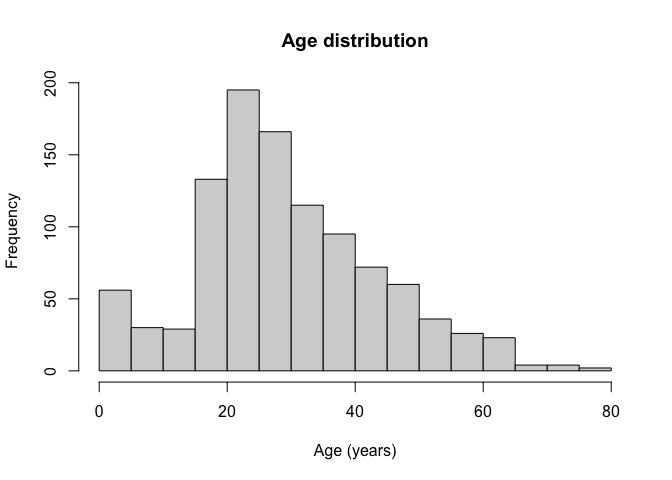
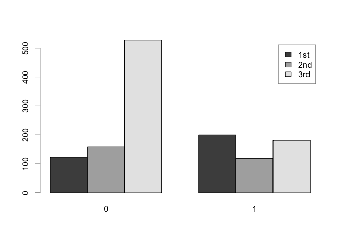
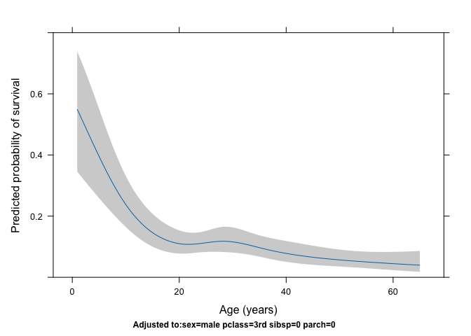
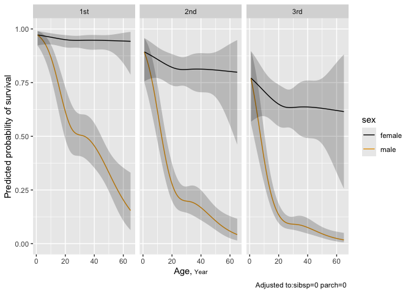

Moving Beyond Linearity
================

## Background

Linear models are relatively simple to describe and implement, and have
advantages over other approaches in terms of interpretation and
inference. However, standard linear regression can have limitations in
terms of predictive power because the assumption of linearity is almost
always an approximation, and sometimes a poor one. Linearity (the
relationship between the predictors and the outcome is linear) is one of
the assumptions of linear regression model. There are several
statistical methods to handle the non linearity. Most sophisticated is
the extension of linear model like polynomial regression, step functions
and splines.

## Polynomial Regression

**Polynomial regression** extends the linear model by adding extra
predictors, obtained by raising each of the original predictors to a
power. For example, a cubic regression uses three variables, $x$, $x^2$,
and $x^3$, as predictors. This approach provides a simple way to provide
a non-linear fit to data.

The relationship between the predictors and the response is non-linear
has been to replace the standard linear model

$$
y_i = β_0 + β_1x_i + ϵ_i
$$

with a polynomial function

$$
y_i = \beta_0 + \beta_1 x_i + \beta_2 x_i^3 + \beta_3x_i^3 + ... + \beta_dx_i^d + \epsilon_i
$$

where ϵi is the error term.

For large enough degree d, a polynomial regression allows us to produce
an extremely non-linear curve. Generally, it is unusual to use d greater
than 3 or 4 because for large values of d, the polynomial curve can
become overly flexible and can take on some very strange shapes.

# Practical Example

We will be analysing complex data ***Wage***. We begin by loading the
ISLR2 library, which contains the data. This data is has 3000
observation of 11 different variables which includes year, age, marital
status, race, logwage, wage, among other.

``` r
library(ISLR2)
library(ggplot2)
wage <- Wage
```

# Assessing non-linearity by visualization

``` r
ggplot(data = wage, aes(x = age, y = wage)) + 
  geom_point()
```

<!-- -->

``` r
# Fitting linear regression

ggplot(data = wage, aes(x = age, y = wage)) + 
  geom_point() + geom_smooth(method = "lm") +
  labs(title = "Linear Regression of Wage in Age")
```

    ## `geom_smooth()` using formula = 'y ~ x'

<!-- -->

# Fitting polynomial regression model

``` r
polyfit <- lm(wage ~ poly(age, 4), data = wage)
coef(summary(polyfit))
```

    ##                 Estimate Std. Error    t value     Pr(>|t|)
    ## (Intercept)    111.70361  0.7287409 153.283015 0.000000e+00
    ## poly(age, 4)1  447.06785 39.9147851  11.200558 1.484604e-28
    ## poly(age, 4)2 -478.31581 39.9147851 -11.983424 2.355831e-32
    ## poly(age, 4)3  125.52169 39.9147851   3.144742 1.678622e-03
    ## poly(age, 4)4  -77.91118 39.9147851  -1.951938 5.103865e-02

This syntax fits a linear model, using the $lm()$ function, in order to
predict wage using a fourth-degree polynomial in age: $poly(age, 4)$.

\###**Visualizing our fitted model**

``` r
# Create a new data frame for prediction
age_grid <- data.frame(age = seq(min(wage$age), max(wage$age), length.out = 100))

# Predict fitted values
age_grid$predicted_wage <- predict(polyfit, newdata = age_grid)

# Plot
ggplot(wage, aes(x = age, y = wage)) +
  geom_point(alpha = 0.5) +                     # original points
  geom_line(data = age_grid, aes(x = age, y = predicted_wage), color = "blue", size = 1.2) +
  labs(title = "4th-degree Polynomial Regression of Wage on Age",
       x = "Age", y = "Wage") +
  theme_minimal()
```

<!-- -->

### **How to decide the degree of polynomial to use?**

In performing a polynomial regression we must decide on the degree of
the polynomial to use. You can do Cross validation, Likelihood Ratio
test, hypothesis test, check AIC. One way to do this is by using
hypothesis tests. We now fit models ranging from linear to a degree-5
polynomial and seek to determine the simplest model which is sufficient
to explain the relationship between wage and age. We use the $anova()$
function, which performs an analysis of variance (ANOVA, using an
F-test) in order to test the null hypothesis that a model M1 is
sufficient to explain the data against the alternative hypothesis that a
more complex model M2 is required.

``` r
poly.M1 <- lm(wage ~ age, data = wage)
poly.M2 <- lm(wage ~ poly(age, 2), data = wage)
poly.M3 <- lm(wage ~ poly(age, 3), data = wage)
poly.M4 <- lm(wage ~ poly(age, 4), data = wage)
poly.M5 <- lm(wage ~ poly(age, 5), data = wage)

anova(poly.M1,poly.M2,poly.M3,poly.M4,poly.M5)
```

    ## Analysis of Variance Table
    ## 
    ## Model 1: wage ~ age
    ## Model 2: wage ~ poly(age, 2)
    ## Model 3: wage ~ poly(age, 3)
    ## Model 4: wage ~ poly(age, 4)
    ## Model 5: wage ~ poly(age, 5)
    ##   Res.Df     RSS Df Sum of Sq        F    Pr(>F)    
    ## 1   2998 5022216                                    
    ## 2   2997 4793430  1    228786 143.5931 < 2.2e-16 ***
    ## 3   2996 4777674  1     15756   9.8888  0.001679 ** 
    ## 4   2995 4771604  1      6070   3.8098  0.051046 .  
    ## 5   2994 4770322  1      1283   0.8050  0.369682    
    ## ---
    ## Signif. codes:  0 '***' 0.001 '**' 0.01 '*' 0.05 '.' 0.1 ' ' 1

The ANOVA comparison indicates that the polynomial terms upto degree 3
significantly improve model fit. Higher order terms beyond 3 do not
provide significant meaningful results, suggesting that the cubic
polynomial is sufficient.

## Step Function

**Step functions** cut the range of a variable into K distinct regions
in order to produce a qualitative variable. This has the effect of
fitting a piece wise constant function. We break the range of X into
bins, and fit a different **constant** in each bin.

## Regression Splines

**Regression splines** are more flexible than polynomials and step
functions, and in fact are an extension of the two. They involve
dividing the range of $X$ into K distinct regions. Within each region, a
polynomial function is fit to the data. However, these polynomials are
constrained so that they join smoothly at the region boundaries, or
knots. Provided that the interval is divided into enough regions, this
can produce an extremely flexible fit.

Divide $X$ into smaller sub-intervals,

$$
x_{min} = t_0 < t_1 < .... t_m < t_{m+1} = x_{max}
$$

The breakpoints $t_1$, $t_m$, $t_{m +1}$ are called knots.

We construct $m + 1$ intervals, and for each sub intervals, we apply
$m + 1$ polynomial functions as mentioned below:

$$ 
f_i(x) = β_{i,0} + β_{i,1}x_1 + β_{i,2}x_2 + β_{i,3}x_3 ....
$$

for $$ i \in [t_0, t_1], [t_1, t_2], ... [t_m, t_{m+1}] $$

where, $x_1, x_2, x_3$ are corresponding polynomial covariates.

## Constraint

**In the next step**, we must ensure that the fitted functions should be
continuous and smooth at each knot. In other words, there should not be
sudden jump or sudden fall in our function at each interior knot. To
solve this, if we have K knots, this is done by making continuous
derivative up to (K-1) order. Assumption of continuous derivatives
ensures that polynomial pieces are joining together smoothly at all
interior knot points.

A polynomial spline of degree p is a function that

- Consists of a polynomial of degree p within each of the intervals, and

- Has continuous derivatives up to the order (p−1) at each knot.

- e.g., a cubic spline consists of polynomial transformations of degree
  3 within each interval and has 2 times continuous derivatives.

## Regression splines using basis functions

Regression splines may initially seem complicated because they involve
fitting piecewise polynomials while ensuring that the function (and some
of its derivatives) remain continuous at the knots. Fortunately, this
complexity can be handled using a basis function representation.

A cubic regression spline with K knots can be written as a linear
regression model:

$$
y_i = \beta_0 + \beta_1 b_1(x_i) + \beta_2 b_2(x_i) + \cdots + \beta_{K+3} b_{K+3}(x_i) + \varepsilon_i
$$

where:

- $b_1(x), \dots, b_{K+3}(x)$ are spline basis function

- $\beta_0, \dots, \beta_{K+3}$ are unknown coefficients

- $\varepsilon_i$ is the error term

## **Truncated power basis for cubic splines**

To construct a cubic spline:

- Start with a cubic polynomial basis: x, x^2, and x^3

- Add one truncated power basis function for each knot

A truncated power basis function is defined as:

$$
h(x, \xi) = (x - \xi)_+^3 =
\begin{cases}
(x - \xi)^3, & x > \xi \\
0, & x \le \xi
\end{cases}
$$

In order to fit a cubic spline to a data set with K knots, we perform
least squares regression with an intercept and 3 + K predictors, of the
form $X, X^2, X^3,h(x,\xi_1)$, $h(x, \xi_2), ... h(x, \xi_K)$, where
$ξ_1, . . . , ξ_K$ are the knots.

## **Restricted/Natural Splines**

Regression splines can exhibit high variance near the boundaries of the
predictor space, that is, when X takes very small or very large values.
In these regions, the fitted curve may behave erratically, leading to
wide and unstable confidence intervals.

A natural spline is a regression spline with additional boundary
constraints: function is required to be linear at the boundary (in the
region where X is smaller than the smallest knot, or larger than the
largest knot). This additional constraint means that natural splines
generally produce more stable estimates at the boundaries.

## Tutorial For Splines

1.  Download the Titanic dataset of the Hmisc package with
    getHdata(titanic3), restrict the data to the variables survived,
    pclass, age, sex, sibsp, parch and examine them depending on the
    survival.

``` r
library(haven)
library(Hmisc)
```

    ## 
    ## Attaching package: 'Hmisc'

    ## The following objects are masked from 'package:base':
    ## 
    ##     format.pval, units

``` r
library(rms)

getHdata(titanic3) 
# The titanic3 dataset describes the survival status of individual passengers on the Titanic

var <- c("survived", "pclass", "age", "sex", "sibsp", "parch")
# survived: survival (0 = No; 1 = Yes)
# pclass: a factor with levels 1st, 2nd, and 3rd
# age: age in years
# sex: a factor with levels female and male
# sibsp: number of siblings/spouses aboard
# parch: number of parents/children aboard


# Create new dataset containing only the variables we want to work with
t3 <- titanic3[, var]


# If you want cross-tabs or other descriptives

prop.table(table(t3$pclass, t3$survived), 1)  # row percentages
```

    ##      
    ##               0         1
    ##   1st 0.3808050 0.6191950
    ##   2nd 0.5703971 0.4296029
    ##   3rd 0.7447109 0.2552891

``` r
# Histograms/ density plots (numeric)
hist(t3$age, main="Age distribution", xlab="Age (years)")
```

<!-- -->

``` r
# Bar plots (categorical)
barplot(table(t3$pclass, t3$survived), beside = TRUE, legend = TRUE)
```

<!-- -->

2.  Build an appropriate full adjusted model of surviving while using
    the numerical variables in a linear way.

``` r
## In the rms workflow, we have to run following codes at first to tell the rms package about the distribution of varaibales in our data set. 

#Setting options(datadist = "dd") allows rms functions to access this information automatically, ensuring consistent model specification, interpretation, and reproducibility.

dd <- datadist(t3)
options(datadist='dd') 


# lrm = logistic regression model from rcs package. lrm() is more sophisticated than base glm() for prediction and validating the model.

f0 <- lrm(survived ~ sex + pclass + age + sibsp + parch, data = t3) 
summary(f0)
```

    ##              Effects              Response : survived 
    ## 
    ##  Factor            Low High Diff. Effect   S.E.    Lower 0.95 Upper 0.95
    ##  age               21  39   18    -0.71080 0.11942 -0.94486   -0.47673  
    ##   Odds Ratio       21  39   18     0.49125      NA  0.38873    0.62081  
    ##  sibsp              0   1    1    -0.35291 0.10536 -0.55941   -0.14642  
    ##   Odds Ratio        0   1    1     0.70264      NA  0.57155    0.86380  
    ##  parch              0   9    9     0.66925 0.89920 -1.09310    2.43160  
    ##   Odds Ratio        0   9    9     1.95280      NA  0.33516   11.37800  
    ##  sex - female:male  2   1   NA     2.55690 0.17328  2.21720    2.89650  
    ##   Odds Ratio        2   1   NA    12.89500      NA  9.18190   18.11000  
    ##  pclass - 1st:3rd   3   1   NA     2.35200 0.22882  1.90350    2.80050  
    ##   Odds Ratio        3   1   NA    10.50700      NA  6.70960   16.45300  
    ##  pclass - 2nd:3rd   3   2   NA     0.98527 0.19939  0.59446    1.37610  
    ##   Odds Ratio        3   2   NA     2.67850      NA  1.81210    3.95930

**Example of Interpretation of lrm():**

Age: Comparing a 39 years old to 21 years old passenger, holding other
variable constant, the odds of survival decreases by ~51% (Effect size
OR = 0.491), and looking at CI, this is statistically significant.

Sex: Comparing female to male, holding other variables constant, the
odds of survival is 12.89 times significantly higher in female than
male.

3.  **Extend the model of \#2 using restricted cubic splines for age
    by**
    1.  Determining a reasonable number of knots
    2.  Checking the linearity-assumption

``` r
rcs_m0 <- lrm(survived ~ sex + pclass + rcs(age, 0) + sibsp + parch, data = t3) # Equivalent to Linear model 
rcs_m1 <- lrm(survived ~ sex + pclass + rcs(age, 3) + sibsp + parch, data = t3) # model with 3 knots
rcs_m2 <- lrm(survived ~ sex + pclass + rcs(age, 4) + sibsp + parch, data = t3) # model with 4 knots
rcs_m3 <- lrm(survived ~ sex + pclass + rcs(age, 5) + sibsp + parch, data = t3)
rcs_m4 <- lrm(survived ~ sex + pclass + rcs(age, 6) + sibsp + parch, data = t3)
rcs_m5 <- lrm(survived ~ sex + pclass + rcs(age, 7) + sibsp + parch, data = t3)
rcs_m6 <- lrm(survived ~ sex + pclass + rcs(age, 8) + sibsp + parch, data = t3)
   

d <- data.frame("knots" = c(0, 3:8), 
                "AIC" = c(AIC(rcs_m0), AIC(rcs_m1), AIC(rcs_m2), AIC(rcs_m3), AIC(rcs_m4), AIC(rcs_m5), AIC(rcs_m6)))

d[order(d$AIC), ]
```

    ##   knots      AIC
    ## 4     5 977.1498
    ## 3     4 978.1138
    ## 5     6 978.9990
    ## 6     7 981.4057
    ## 2     3 982.0288
    ## 7     8 982.8882
    ## 1     0 984.1193

**Automation using function:**

``` r
mx <- matrix(nrow = 0, ncol = 2)
colnames(mx) <- c("knots", "AIC")

for(i in c(0, 3:8)){
  m <- lrm(survived ~ sex + pclass + rcs(age, i) + sibsp + parch, data = t3)
  mx <- rbind(mx, c(i, round(AIC(m), 2)))
  
}

mx[order(mx[, 2]),]
```

    ##      knots    AIC
    ## [1,]     5 977.15
    ## [2,]     4 978.11
    ## [3,]     6 979.00
    ## [4,]     7 981.41
    ## [5,]     3 982.03
    ## [6,]     8 982.89
    ## [7,]     0 984.12

**Checking the linearity of the function**

``` r
f <- lrm(survived ~ sex + pclass + rcs(age, 5) + sibsp + parch, data = t3)  

anova(f) # test for linearity
```

    ##                 Wald Statistics          Response: survived 
    ## 
    ##  Factor     Chi-Square d.f. P     
    ##  sex        220.24     1    <.0001
    ##  pclass      98.80     2    <.0001
    ##  age         45.44     4    <.0001
    ##   Nonlinear  12.29     3    0.0064
    ##  sibsp       15.34     1    0.0001
    ##  parch        0.01     1    0.9145
    ##  TOTAL      283.32     9    <.0001

Since the nonlinear estimate is significant, the non linearity
assumption is valid.

**Visualization of the prediction of the survival against age**

``` r
p <- Predict(f, age, fun = plogis) # fun = plogis converts log odds into probability

plot(p,
     xlab = "Age (years)",
     ylab = "Predicted probability of survival")
```

<!-- -->

4.  Compare statistically the models of \#2 (f0) and \#3 (f)

``` r
lrtest(f0, f) 
```

    ## 
    ## Model 1: survived ~ sex + pclass + age + sibsp + parch
    ## Model 2: survived ~ sex + pclass + rcs(age, 5) + sibsp + parch
    ## 
    ##   L.R. Chisq         d.f.            P 
    ## 12.969454675  3.000000000  0.004703129

5.  Checking whether age is modifed by sex and plot the associations
    depending on passenger class

``` r
anova(f3 <- lrm(survived ~ rcs(age, 4)*sex + pclass + sibsp + parch, data = t3))
```

    ##                 Wald Statistics          Response: survived 
    ## 
    ##  Factor                                   Chi-Square d.f. P     
    ##  age  (Factor+Higher Order Factors)        63.61      6   <.0001
    ##   All Interactions                         26.44      3   <.0001
    ##   Nonlinear (Factor+Higher Order Factors)  15.30      4   0.0041
    ##  sex  (Factor+Higher Order Factors)       225.50      4   <.0001
    ##   All Interactions                         26.44      3   <.0001
    ##  pclass                                    95.57      2   <.0001
    ##  sibsp                                     16.31      1   0.0001
    ##  parch                                      0.29      1   0.5874
    ##  age * sex  (Factor+Higher Order Factors)  26.44      3   <.0001
    ##   Nonlinear                                 4.54      2   0.1031
    ##   Nonlinear Interaction : f(A,B) vs. AB     4.54      2   0.1031
    ##  TOTAL NONLINEAR                           15.30      4   0.0041
    ##  TOTAL NONLINEAR + INTERACTION             33.56      5   <.0001
    ##  TOTAL                                    287.23     11   <.0001

``` r
p1 <- Predict(f3, age, sex, pclass, fun = plogis)  
ggplot(p1,
       ylab = "Predicted probability of survival") 
```

<!-- -->

The relationship between age and survival differs between males and
females (age \* sex: Chi-Square = 26.44, p \<.0001 ).
